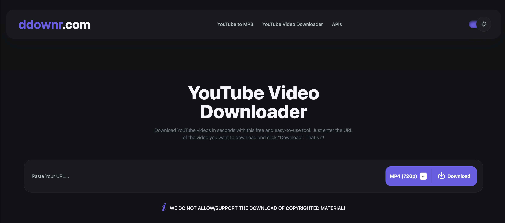

# ytviddl-ddownr



## Overview 📝

**ytviddl-ddownr** is an automated tool designed to download YouTube videos using the [ddownr.com](https://ddownr.com/en/youtube-video-downloader) service. The script leverages Selenium to interact with the website, input video URLs, and manage the download process seamlessly. This project is useful for automating the bulk download of videos, ensuring they are saved and organized into a specified directory on your system.

## Development 🚀

### Requirements 📋

- Install dependencies from `requirements.txt`:

  ```bash
  pip install -r requirements.txt
  ```

- Chrome Driver: Ensure you have the appropriate Chrome WebDriver installed.

> If needed, consider using a virtual environment. 🔄

To set up a virtual environment:

```bash
# Navigate to your project directory
cd <your_project_directory>

# Deactivate any existing virtual environment
deactivate

# Verify the paths for Python and pip
which python
which pip

# Remove any existing virtual environment
rm -rf venv

# Create a new virtual environment
python3 -m venv venv

# Activate the new virtual environment
source venv/bin/activate

# Verify the paths for Python and pip within the virtual environment
which python
which pip

# Install the required dependencies
pip install -r requirements.txt
```

### Running the Script ▶️

To execute the main script, run:

```bash
python ./main.py
```